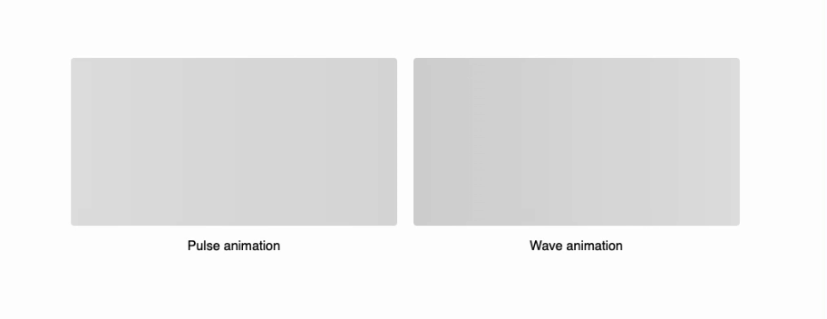
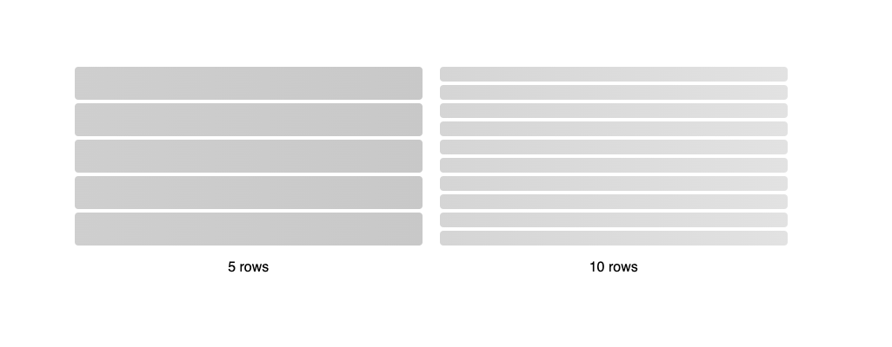
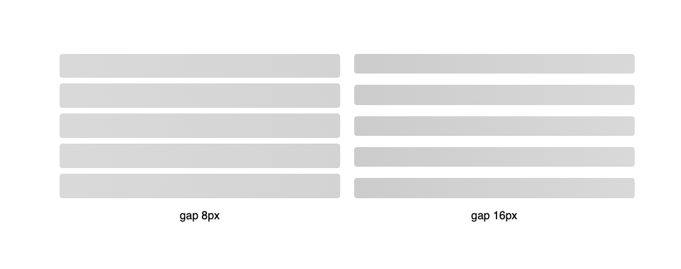
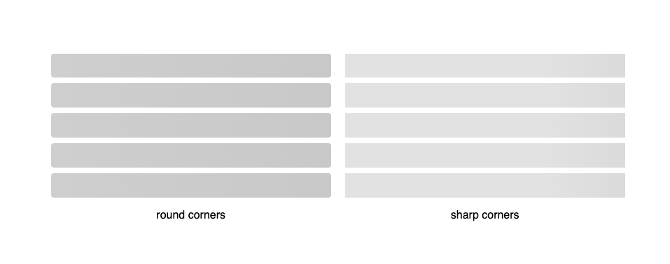
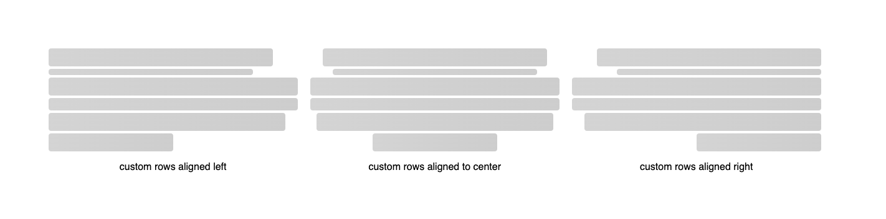
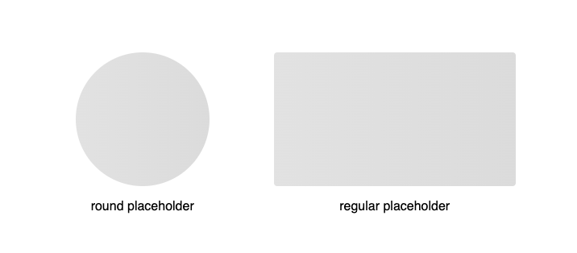
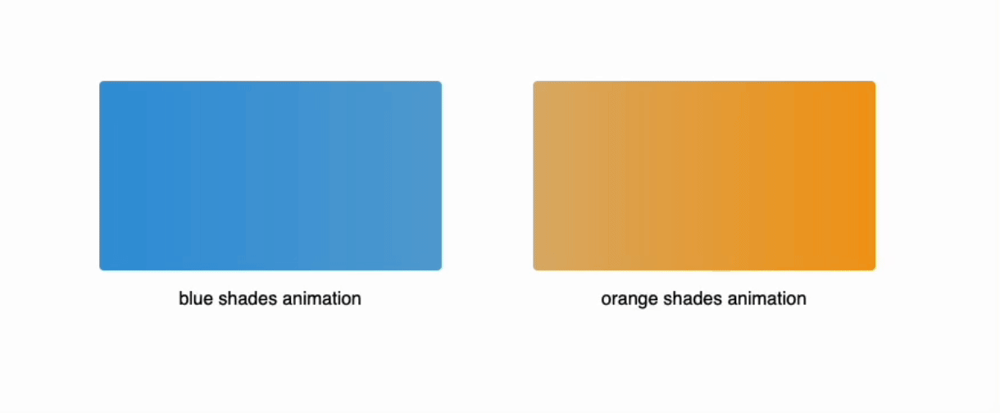
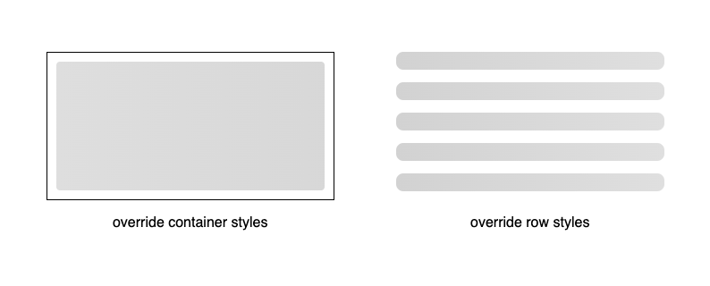

# Animate Load

Animate Load is a lightweight React component for creating animated loading placeholders that automatically adapt to your app.


#### 👉 [Codesand Demo Here ](https://codesandbox.io/p/sandbox/react-animate-load-example-yt4mv8) 👈

## Installation

You can install the library via npm or yarn:

```bash
npm install react-animate-load
```

or

```bash
yarn add react-animate-load
```

## Usage

Here's a basic example of how to use the Animate Load component in your React project:

```tsx
import { AnimateLoad, Align } from "react-animate-load";

<AnimateLoad /> // Using the default values

<AnimateLoad numRows={3}/> // Three lines loading skeleton

<AnimateLoad
      animation="pulse"
      numRows={3}
      gapRow="10px"
      roundCorner={true}
      primaryColor="#e2e2e2"
      secondaryColor="#c8c8c8"
      align={Align.CENTER}
      customRows={[
        { index: 0, width: "100%", height: "20px" },
        { index: 1, width: "80%", height: "20px" },
        { index: 2, width: "60%", height: "20px" },
      ]}
    /> // Full customized loading
```

#### The default width and height is the same as his parent component

## Props

| Prop Name        | Type                  | Default Value | Description                                                 |
| ---------------- | --------------------- | ------------- | ----------------------------------------------------------- |
| `animation`      | `string`              | `"pulse"`     | The type of animation to apply (`PULSE` or `WAVE`).         |
| `numRows`        | `number`              | `1`           | The number of animated rows to display.                     |
| `customRows`     | `CustomRow[]`         | `[]`          | Array to define custom dimensions for specific rows.        |
| `gapRow`         | `string`              | `"4px"`       | Gap between the rows.                                       |
| `roundCorner`    | `boolean`             | `true`        | Whether the rows should have rounded corners.               |
| `round`          | `boolean`             | `false`       | Whether the placeholder should be round.                    |
| `containerStyle` | `React.CSSProperties` | `{}`          | Custom styles for the container.                            |
| `rowStyle`       | `React.CSSProperties` | `{}`          | Custom styles for the individual rows.                      |
| `primaryColor`   | `string`              | `"#e2e2e2"`   | Primary color used for the loading animation.               |
| `secondaryColor` | `string`              | `"#c8c8c8"`   | Secondary color used for the loading animation.             |
| `align`          | `Align`               | `Align.LEFT`  | Alignment of the animated rows (`LEFT`, `CENTER`, `RIGHT`). |

## Examples

These examples cover the usage of various props to customize the Animate Load component.

### Animation Effect

There are two animations effects that can be used:

```tsx
import { AnimateLoad } from "react-animate-load";

<AnimateLoad animation="pulse" /> // Using the pulse animation

<AnimateLoad animation="wave" /> // Using the wave animation
```



### Number of rows

You can customize the number of animated rows using the numRows prop:

```tsx
import { AnimateLoad } from "react-animate-load";

<AnimateLoad numRows={5} /> // Displaying 5 animated rows

<AnimateLoad numRows={10} /> // Displaying 10 animated rows
```



### Gap between rows

Adjust the gap between the rows using the gapRow prop:

```tsx
import { AnimateLoad } from "react-animate-load";

<AnimateLoad gapRow="8px" /> // 8px gap between rows

<AnimateLoad gapRow="16px" /> // 16px gap between rows
```



### Round corners

Control whether the rows have rounded corners with the roundCorner prop:

```tsx
import { AnimateLoad } from "react-animate-load";

<AnimateLoad roundCorner={true} /> // Rows with rounded corners

<AnimateLoad roundCorner={false} /> // Rows with sharp corners
```



### Customize rows width and height and align rows

Customize the dimensions and alignment of individual rows using the customRows and align props:

```tsx
import { AnimateLoad, Align } from "react-animate-load";

const customRows = [
  { index: 0, width: "90%" },
  { index: 1, width: "82%", height: "10px" },
  // no need to set the index 2 row, it will assume the default values (width: 100%, height: 100%)
  { index: 3, height: "20px" },
  { index: 4, width: "95%", height: "30px" },
  { index: 5, width: "50%" },
];

<AnimateLoad customRows={customRows} /> // Custom width and height, aligned to left (default value)

<AnimateLoad customRows={customRows} align={Align.LEFT} /> // Custom width and height, aligned to left

<AnimateLoad customRows={customRows} align={Align.CENTER} /> // Custom width and height, aligned to center

<AnimateLoad customRows={customRows} align={Align.RIGHT} /> // Custom width and height, aligned to right
```



### Round component

Create a round loading placeholder with the round prop:

```tsx
import { AnimateLoad } from "react-animate-load";

<AnimateLoad round={true} /> // Round placeholder - the width and height of the parent should be equal

<AnimateLoad round={false} /> // Regular placeholder
```



### Animation colors

Change the primary and secondary colors of the animation with primaryColor and secondaryColor props:

```tsx
import { AnimateLoad } from "react-animate-load";

<AnimateLoad primaryColor="#3498db" secondaryColor="#c8c8c8" /> // Blue shades animation

<AnimateLoad primaryColor="#f39c12" secondaryColor="#c8c8c8" /> // Orange shades animation
```



### Override styles

#### Container styles

Override the container’s styles using the containerStyle prop:

```tsx
import { AnimateLoad } from "react-animate-load";

<AnimateLoad containerStyle={{ border: "solid 1px", padding: "10px" }} />; // Custom container styles
```

#### Row styles

Override the styles of individual rows using the rowStyle prop:

```tsx
import { AnimateLoad } from "react-animate-load";

<AnimateLoad rowStyle={{ borderRadius: "8px", marginBottom: "10px" }} />; // Custom row styles
```



## Contributing

Contributions are welcome! See `CONTRIBUTING.md` to get started.

## License

This project is licensed under the MIT License - see the [LICENSE](https://github.com/tfmteixeira/react-animate-load?tab=MIT-1-ov-file) file for details.

---

Happy loading! 🎉
